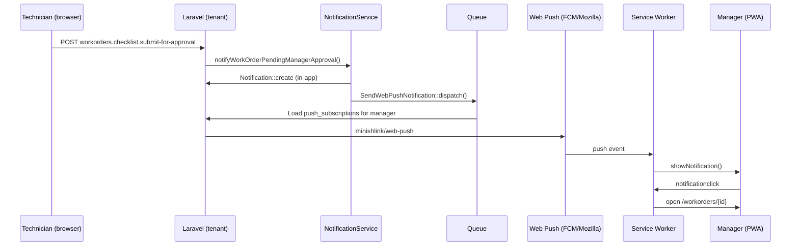

# Web Push Notifications — Implementation Plan

## Goal

Send **native-style push notifications** to managers (and eventually other staff) when important in-app events occur — starting with **work order pending manager approval**.

This builds on the existing stack:

- In-app notifications (`notifications` table + bell dropdown)
- `NotificationService` (creates notification records with `route` / `route_params`)
- PWA (`vite-plugin-pwa`, service worker at `/sw.js`)
- Tenant-scoped `users` (`assigned_to_user_id` on notifications)
- Queue worker (`QUEUE_CONNECTION=database`)

Web Push is **additive**: keep the in-app bell as the source of truth; push is a delivery channel on top.

---

## Scope

### MVP (phase 1)

| In scope | Out of scope (later) |
|----------|----------------------|
| Push when WO submitted for manager approval | Push for every `NotificationService` type |
| Subscribe / unsubscribe API | Per-notification-type preferences UI |
| Service worker `push` + `notificationclick` handlers | Email fallback |
| Opt-in prompt for managers (and admins) | Admin dashboard for delivery stats |
| Queue-backed send job | Safari non-PWA tab support |

### Success criteria

1. Manager with PWA installed on phone receives a push within ~30s of technician submitting for approval.
2. Tapping the push opens the correct work order show page.
3. In-app bell notification still appears (unchanged behavior).
4. Expired browser subscriptions are cleaned up automatically.
5. User who denies permission can still use the app normally.

---

## Architecture



### Data model (tenant DB)

New table: `push_subscriptions`

| Column | Type | Notes |
|--------|------|-------|
| `id` | bigint | PK |
| `user_id` | FK → `users` | Tenant staff user |
| `endpoint` | text | Unique per browser/device |
| `public_key` | string | Client `p256dh` |
| `auth_token` | string | Client `auth` |
| `content_encoding` | string | Usually `aesgcm` |
| `user_agent` | string nullable | Debugging |
| `last_used_at` | timestamp nullable | Optional |
| `created_at` / `updated_at` | timestamps | |

Indexes: `user_id`, unique `endpoint`.

Optional later: `push_enabled` boolean on `users` or a small `user_notification_preferences` table.

### Config (central `.env`)

```
VAPID_SUBJECT=mailto:admin@yourdomain.com
VAPID_PUBLIC_KEY=...
VAPID_PRIVATE_KEY=...
```

Generate once: `php artisan webpush:vapid` (if using a package) or `npx web-push generate-vapid-keys`.

Expose **public** key to the frontend via Inertia shared prop or a small config endpoint.

---

## Implementation phases

### Phase 1 — Dependencies & keys (~2 hours)

1. Add `minishlink/web-push` to `composer.json`.
2. Add `config/webpush.php` (VAPID subject, public/private keys from env).
3. Document env vars in `.env.example`.
4. Share `vapidPublicKey` in `HandleInertiaRequests` (tenant context only).

**Files**

- `composer.json`
- `config/webpush.php` (new)
- `.env.example`
- `app/Http/Middleware/HandleInertiaRequests.php`

---

### Phase 2 — Database & model (~2 hours)

1. Tenant migration: `push_subscriptions`.
2. Model: `App\Domain\Notification\Models\PushSubscription` (or `App\Domain\PushSubscription\Models\PushSubscription`).
3. Relationship on `User`: `pushSubscriptions()`.

**Files**

- `database/migrations/tenant/YYYY_MM_DD_create_push_subscriptions_table.php`
- `app/Domain/Notification/Models/PushSubscription.php` (new)
- `app/Domain/User/Models/User.php`

Run: `php artisan tenants:migrate`

---

### Phase 3 — Subscribe / unsubscribe API (~3 hours)

**Routes** (under existing `notifications.` group in `routes/tenant.php`):

```
POST   /notifications/push/subscribe     → store subscription
DELETE /notifications/push/subscribe     → remove by endpoint (or POST unsubscribe)
GET    /notifications/push/status        → { subscribed: bool, permission: string }
```

**Controller**: `PushSubscriptionController`

- `subscribe(Request)` — validate endpoint + keys; upsert by `endpoint` for `current_tenant_user_id()`.
- `unsubscribe(Request)` — delete matching endpoint for current user.
- `status()` — whether user has ≥1 subscription and `Notification.permission` state (passed from client or inferred).

Auth: same middleware as other tenant notification routes (authenticated tenant staff).

**Files**

- `app/Http/Controllers/Tenant/PushSubscriptionController.php` (new)
- `routes/tenant.php`

---

### Phase 4 — Service worker push handlers (~3 hours)

Extend PWA service worker to handle push events. With `vite-plugin-pwa`, use `injectManifest` strategy or `workbox` `importScripts` / custom SW file.

**Recommended approach**

1. Create `resources/js/sw-push.js` with:
   - `push` listener → `event.data.json()` → `self.registration.showNotification(title, { body, icon, data: { url } })`
   - `notificationclick` → `clients.openWindow(url)` (focus existing client if same URL)

2. Wire into `vite.config.js` `VitePWA` via `strategies: 'injectManifest'` **or** `workbox.importScripts: ['push-handlers.js']` copied to `public/`.

Payload shape from server:

```json
{
  "title": "Work Order Pending Approval",
  "body": "WO-123 submitted by Jane Doe is pending manager approval.",
  "url": "/workorders/42",
  "tag": "work_order_pending_approval:42"
}
```

Use `tag` to collapse duplicate notifications for the same WO.

**Files**

- `resources/js/sw-push.js` (new)
- `vite.config.js`
- Rebuild: `npm run build` (SW only emitted in production build per current config)

**Note:** Local `*.test` dev will not receive real pushes. Test on HTTPS staging.

---

### Phase 5 — Frontend subscription UX (~4 hours)

**Composable**: `resources/js/composables/useWebPush.js`

Responsibilities:

1. Check `('serviceWorker' in navigator) && ('PushManager' in window)`.
2. Read `vapidPublicKey` from Inertia shared props.
3. `requestPermission()` → `Notification.requestPermission()`.
4. `subscribe()`:
   - `registration = await navigator.serviceWorker.ready`
   - `subscription = await registration.pushManager.subscribe({ userVisibleOnly: true, applicationServerKey: urlBase64ToUint8Array(vapidPublicKey) })`
   - `POST` subscription JSON to `notifications.push.subscribe`
5. `unsubscribe()` → `pushManager.getSubscription()` → unsubscribe → `DELETE` on server.

**Where to prompt (MVP)**

- **Option A (simplest):** Banner on `WorkOrder/Show.vue` approval tab for users who are managers and lack a subscription.
- **Option B (better UX):** Small card in Account settings or navbar dropdown: “Enable push notifications”.
- **Option C:** Prompt once after login if `tenant_role_slug` is `manager` or `administrator`.

Recommend **B + soft prompt on WO show** for managers who land there without push enabled.

Do **not** call `requestPermission()` on first page load without user gesture (browser will often deny).

**Files**

- `resources/js/composables/useWebPush.js` (new)
- `resources/js/Components/Tenant/WebPushOptIn.vue` (new, optional banner/toggle)
- `resources/js/Layouts/TenantLayout.vue` or `Navbar.vue` (mount opt-in)
- `resources/js/Pages/Tenant/WorkOrder/Show.vue` (manager-specific nudge)

---

### Phase 6 — Send job & NotificationService hook (~4 hours)

**Job**: `App\Jobs\SendWebPushNotification`

```php
SendWebPushNotification::dispatch(
    userId: $manager->id,
    title: '...',
    body: '...',
    url: route('workorders.show', $workOrder, false), // relative path for SW
    tag: 'work_order_pending_approval:'.$workOrder->id,
);
```

Job logic:

1. Load all `PushSubscription` rows for `user_id`.
2. Use `Minishlink\WebPush\WebPush` + VAPID auth.
3. Send payload; on **410 Gone** or **404**, delete subscription.
4. Log failures; do not fail the request that created the in-app notification.

**Refactor (small):** Extract shared payload builder from `NotificationService` so in-app + push stay in sync:

```php
$payload = [
    'assigned_to_user_id' => $manager->id,
    'type' => 'work_order_pending_approval',
    'title' => '...',
    'message' => '...',
    'route' => 'workorders.show',
    'route_params' => ['workorder' => $workOrder->id],
];

Notification::create($payload);
SendWebPushNotification::dispatchForNotification($manager->id, $payload);
```

Helper on job resolves `url` from `route` + `route_params` using existing `Notification` model logic (`getRouteParameters()`).

**Files**

- `app/Jobs/SendWebPushNotification.php` (new)
- `app/Services/NotificationService.php` (hook in `notifyWorkOrderPendingManagerApproval`)
- `app/Domain/Notification/Models/Notification.php` (optional: `absoluteUrl()` helper)

Ensure **queue worker is running** in each environment (`php artisan queue:listen`).

---

### Phase 7 — Testing & rollout (~4 hours)

#### Manual test plan

| Step | Action | Expected |
|------|--------|----------|
| 1 | Deploy/build on **HTTPS** host | `/sw.js` registers |
| 2 | Manager logs in, enables push | `push_subscriptions` row created |
| 3 | Tech submits WO for approval | In-app + push received |
| 4 | Tap push on Android PWA | Opens correct WO |
| 5 | Tap push on iOS PWA (16.4+, installed) | Opens correct WO |
| 6 | Revoke permission in OS settings | App still works; no crash |
| 7 | Stale subscription (clear site data) | Server deletes row on 410 |

#### Automated tests (minimal)

- Feature test: `POST subscribe` stores subscription for current tenant user.
- Unit test: job deletes subscription on 410 response (mock WebPush).
- Feature test: `notifyWorkOrderPendingManagerApproval` dispatches job (use `Queue::fake()`).

#### Platform notes

| Platform | Requirement |
|----------|-------------|
| Android Chrome PWA | Install optional; push works in browser too |
| iOS Safari | **Must** add to Home Screen; not available in normal Safari tab |
| Desktop Chrome/Edge | Works in browser and installed PWA |
| Local `*.test` | Push generally **not** testable; use staging |

---

## File checklist (MVP)

| Action | Path |
|--------|------|
| New | `docs/WEB_PUSH.md` (this plan) |
| New | `config/webpush.php` |
| New | `database/migrations/tenant/..._create_push_subscriptions_table.php` |
| New | `app/Domain/Notification/Models/PushSubscription.php` |
| New | `app/Http/Controllers/Tenant/PushSubscriptionController.php` |
| New | `app/Jobs/SendWebPushNotification.php` |
| New | `resources/js/composables/useWebPush.js` |
| New | `resources/js/sw-push.js` (or equivalent) |
| New | `resources/js/Components/Tenant/WebPushOptIn.vue` |
| Edit | `composer.json` |
| Edit | `.env.example` |
| Edit | `vite.config.js` |
| Edit | `routes/tenant.php` |
| Edit | `app/Services/NotificationService.php` |
| Edit | `app/Domain/User/Models/User.php` |
| Edit | `app/Http/Middleware/HandleInertiaRequests.php` |
| Edit | `resources/js/Layouts/TenantLayout.vue` or `Navbar.vue` |
| Test | `tests/Feature/PushSubscriptionTest.php` |
| Test | `tests/Unit/SendWebPushNotificationTest.php` |

---

## Effort estimate

| Phase | Hours |
|-------|-------|
| 1. Dependencies & keys | 2 |
| 2. Database & model | 2 |
| 3. Subscribe API | 3 |
| 4. Service worker | 3 |
| 5. Frontend UX | 4 |
| 6. Send job + hook | 4 |
| 7. Testing & staging | 4 |
| **Total MVP** | **~22 hours (3–4 dev days)** |

Buffer for iOS PWA quirks and SW build tuning: +1 day.

---

## Phase 2 expansion (post-MVP)

1. **Broadcast all notification types** — call `SendWebPushNotification` from a single place (e.g. `Notification::created` observer) instead of per-method hooks.
2. **User preferences** — mirror SMS pattern (`AccountSmsNotificationsController`); toggle push per type.
3. **Manager-only default** — auto-prompt users with `manager` / `administrator` role.
4. **Badge count** — `navigator.setAppBadge(unreadCount)` where supported (optional).
5. **Monitoring** — log send success/failure rates; alert on high 410 rate.

---

## Risks & mitigations

| Risk | Mitigation |
|------|------------|
| iOS users expect push in Safari tab | Document “Add to Home Screen”; show in-app banner if not standalone |
| Permission denied permanently | Don’t nag; rely on in-app bell |
| Queue not running in prod | Document in deploy checklist; consider `sync` only for dev |
| SW update breaks subscriptions | Re-subscribe after `controllerchange` / SW `activated` |
| Multi-device managers | Store multiple rows per user (unique `endpoint`) |
| Tenancy | All push data in **tenant** DB; VAPID keys can be global per app |

---

## Suggested implementation order

1. Phase 1–3 (backend subscribe API) — test with `curl` + manual subscription JSON.
2. Phase 4 (SW handlers) — test with [web-push testing tools](https://web-push-codelab.glitch.me/) or package CLI.
3. Phase 5 (frontend opt-in) — end-to-end on staging HTTPS.
4. Phase 6 (job + WO hook) — full workflow test.
5. Phase 7 (tests + docs for team).

Start with **work order pending approval only**; generalize once the pipeline is proven.
